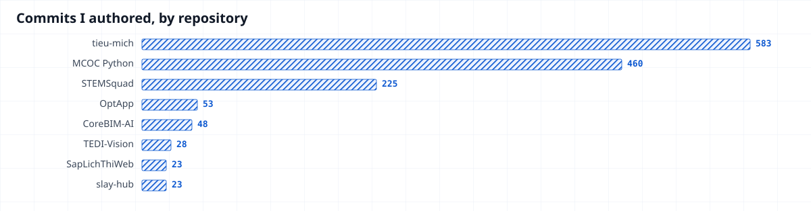

<!-- Hallmark - pre-emit critique: P5 H4 E4 S5 R4 V5 -->

<div align="center">




</div>


## About

Civil engineering by training, software by practice. Most of what I ship runs inside a
design office: pile-layout optimizers, section-analysis engines, and document pipelines
that have to agree with a national standard, not merely look plausible.

Rule I work by: **deterministic where an answer must be defensible, models where it must be flexible.**

```text
Focus     bridge foundations · RC & prestressed sections · geotechnical pipelines
Also      combinatorial optimization · LLM tool-calling agents · full-stack delivery
Security  GRC · IAM · cryptography · cloud & container · DFIR/CTI · RE · web3
Stack     Python · C# / .NET · TypeScript · Go · Dart · Rust · SQL
Reach     github.com/viethuynh243
```

<div align="center">


</div>


## Activity

<div align="center">
  <picture>
    <source media="(prefers-color-scheme: dark)"  srcset="./assets/snake/snake-dark.svg" />
    <source media="(prefers-color-scheme: light)" srcset="./assets/snake/snake-light.svg" />
    
  </picture>
</div>

<div align="center">
  
</div>

<div align="center">
  
  
  
</div>


## Work

<!-- STATS:START -->
<!-- Generated by scripts/render.mjs from data/stats.json — do not edit by hand. -->

I authored **1,424** commits across the repositories below, last refreshed 2026-08-08. Where a repository has several contributors, the count is mine alone. 🔒 marks a private repository.

### Structural and geotechnical, at TEDI

| Project | What it does | Stack | My commits |
|---|---|---|:--:|
| **MCOC Python** 🔒 | Full port of MCOC, the in-house spatial rigid pile-cap analysis package, from VB6 to Python. Deviation against the original engine stays under 0.1% across the whole test corpus. Ships a Qt desktop app, CLI, batch mode, Excel and PDF reports, section audit and licensing. Co-authored. | Python · PySide6 | **170** of 180 |
| [**OptApp**](https://github.com/viethuynh243/OptApp) | Cuts pile count on bridge foundations. NSGA-II search, every candidate scored by the exact MCOC engine rather than a surrogate, because contractors only accept exact numbers. | Python · Tkinter | **36** |
| **TEDI-Vision** 🔒 | Borehole PDFs in, pile-capacity table out. Deterministic rules on TCVN 11823-10:2017, plus a review sheet flagging every cell an engineer must check. It reads, it does not guess. | Python · OCR | **25** |
| **TEDI-BRAIN** 🔒 | Flags expired standards cited in bridge and road design dossiers, resolving every TCVN and QCVN reference against its current legal status. | Python | **160** |
| **geosct** 🔒 | Pile capacity as an importable library. Soil profile in, capacity out, engineer in the loop. | Python · YAML | **2** |

### Optimization and research

| Project | What it does | Stack | My commits |
|---|---|---|:--:|
| [**BaoPhuCam**](https://github.com/viethuynh243/BaoPhuCam) | Places surveillance cameras for maximum coverage, running line-of-sight over a real master plan where buildings, trees and water all block. Deployed at Jackfruit Village. | Python | **14** |
| **SapLichThiWeb** 🔒 | Exam scheduling for HUST: multi-phase graph coloring, bin packing and simulated annealing, solver progress streaming to the browser. Algorithm design mine (co-author, Q1 paper in review); implementation is a team effort. | .NET 8 · Blazor | **19** of 516 |

### Platforms

| Project | What it does | Stack | My commits |
|---|---|---|:--:|
| **STEMSquad** 🔒 | Runs a student organization end to end: members, projects, finance, inventory, CRM and HR. 64 tables across 13 domains, migration-first. | React · Supabase | **228** of 229 |
| **CoreBIM-AI** 🔒 | Web platform for TEDI's CoreBIM-AI unit. React 19 SPA, Express 5 API, one compose file for the whole stack. | React 19 · Express | **48** |
| **slay-hub** 🔒 | Check-in, CMS and admin console for a community org, on Supabase edge functions. | TypeScript · Supabase | **61** of 78 |
| **36streets** 🔒 | AI trip planner. Swap a stop and the rest of the day reschedules around it. Group expense splitting included. | Flutter · Go · MongoDB | **13** of 17 |

### AI agents and tooling

| Project | What it does | Stack | My commits |
|---|---|---|:--:|
| **tieu-mich** 🔒 | Discord butler on a Claude tool-calling loop over a RAG knowledge base, with minigames, voice tracking and a ticket queue. My largest codebase. | Python · Claude API | **639** |
| [**agentic-seo-marketing**](https://github.com/viethuynh243/agentic-seo-marketing) | Astro SSG engine plus a React control dashboard, with serverless connectors for GSC, GA4, Meta and TikTok. | Astro · React · Vercel | **1** |
| [**kpi-sheets-onedrive**](https://github.com/viethuynh243/kpi-google-sheets-onedrive-automation) | Moves KPI data between Google Sheets and OneDrive on a schedule. | Python | **8** |

<!-- STATS:END -->


## Security

A private lab I keep reproducible: seven domains, each with its own skills sheet, tooling
and templates. Defensive and authorized-testing work only. Findings are verified
exploitable before they are reported, and scope decisions are written down as ADRs.

| Domain | Covers |
|---|---|
| **GRC** | Control frameworks, policy mapping, audit evidence templates |
| **IAM** | Identity protocols (OIDC, SAML, OAuth), policy design, least-privilege review |
| **Cryptography** | Algorithm selection, key management, protocol misuse review |
| **Cloud and container** | Platform hardening, compliance baselines, image and runtime checks |
| **DFIR and threat intel** | Case workflow, evidence handling, IOC feeds, forensic triage |
| **Reverse engineering** | Static and dynamic analysis, instrumented labs, binary triage |
| **Web3** | Contract audit workflow, exploit-class labs, review templates |

The environment is disposable by design. Kali and Ubuntu boxes come up from Vagrantfiles,
so a lab gets rebuilt rather than repaired.


## What I bring

| | |
|---|---|
| **Numerical engines** | RC and prestressed section analysis, moment-curvature, P-M and biaxial interaction, slenderness. Verified against reference engines to the last displayed digit. |
| **Optimization** | NSGA-II, simulated annealing, graph coloring, bin packing, under an evaluation budget when each call is expensive. |
| **AI systems** | LLM tool-calling agents, RAG retrieval, OCR and document pipelines. |
| **Full-stack** | React, TypeScript, .NET 8 with Blazor, Supabase and Postgres, Flutter, Go, Docker. Migration-first schemas, documented decisions. |
| **Binary and format analysis** | Decompilation, file-format recovery and oracle test harnesses, keeping decades-old engineering calculations running on machines that no longer support them. |
| **Security** | Seven-domain lab covering GRC, IAM, cryptography, cloud and container, DFIR/CTI, reverse engineering and web3. Defensive and authorized testing only. |


<div align="center">

### Open to structural-software and optimization work.

Most repositories are private. Ask and I will walk you through any of them.

<a href="https://github.com/viethuynh243"></a>

</div>
