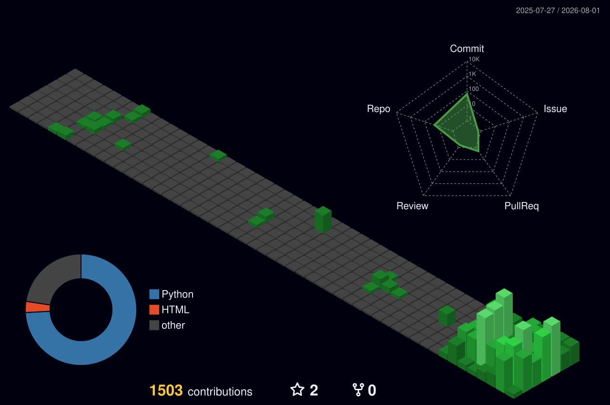

<div align="center">


<br/>


</div>

---

## About

Civil engineering by training, software by practice. Most of what I ship runs inside a
design office: pile-layout optimizers, section-analysis engines, and document pipelines
that have to agree with a national standard, not merely look plausible.

Rule I work by: **deterministic where an answer must be defensible, models where it must be flexible.**

```text
Focus     bridge foundations · RC & prestressed sections · geotechnical pipelines
Also      combinatorial optimization · LLM tool-calling agents · full-stack delivery
Stack     Python · C# / .NET · TypeScript · Go · Dart · SQL
Reach     github.com/viethuynh243
```

---

## Stack

<div align="center">


</div>

---

## Contributions

<div align="center">
  
</div>

---

## Metrics

<div align="center">
  
</div>

<div align="center">


</div>

> Public cards read public repositories only. The bulk of my work is private client and
> research code, so the table below is the honest picture.

---

## Work

Counts measured from working copies on 2026-08-01. 🔒 = private.

### Structural &amp; geotechnical — TEDI

| Project | What it does | Stack | Commits |
|---|---|---|:--:|
| [**OptApp**](https://github.com/viethuynh243/OptApp) | Cuts pile count on bridge foundations. NSGA-II search, every candidate scored by the exact MCOC engine — no surrogate. | Python · Tkinter | 42 |
| **TEDI-Vision** 🔒 | Borehole PDFs in, pile-capacity table out. Deterministic rules on TCVN 11823-10:2017, plus a review sheet flagging every cell an engineer must check. | Python · OCR | 28 |
| **TEDI-BRAIN** 🔒 | Flags expired standards cited in bridge and road design dossiers. | Python | 16 |
| **geosct** 🔒 | Pile capacity as an importable library — soil profile in, capacity out, engineer in the loop. | Python · YAML | — |

### Optimization &amp; research

| Project | What it does | Stack | Commits |
|---|---|---|:--:|
| **SapLichThiWeb** 🔒 | Schedules every exam at HUST. Graph coloring → bin packing → simulated annealing, solver progress streaming to the browser. | .NET 8 · Blazor | 551 |
| [**BaoPhuCam**](https://github.com/viethuynh243/BaoPhuCam) | Places surveillance cameras for maximum coverage. Line-of-sight over a real master plan. Deployed at Jackfruit Village. | Python | 14 |
| **Result_saplichthi** 🔒 | Benchmarks the schedulers against each other across 36 result sets. | Python · pandas | — |

### Platforms

| Project | What it does | Stack | Commits |
|---|---|---|:--:|
| **STEMSquad** 🔒 | Runs a student organization end to end — members, projects, finance, inventory, CRM, HR. 64 tables, migration-first. | React · Supabase | 225 |
| **CoreBIM_AI_Platform** 🔒 | Web platform for TEDI's CoreBIM-AI unit. React 19 SPA, Express 5 API, one compose file for the stack. | React 19 · Express | 48 |
| **slay-hub** 🔒 | Check-in, CMS and admin console for a community org, on Supabase edge functions. | TypeScript · Supabase | 23 |
| **36streets** 🔒 | AI trip planner — swap a stop and the day reschedules around it, with group expense splitting. | Flutter · Go · MongoDB | 11 |

### AI agents &amp; tooling

| Project | What it does | Stack | Commits |
|---|---|---|:--:|
| **tieu-mich** 🔒 | Discord butler on a Claude tool-calling loop over a RAG knowledge base, with minigames, voice tracking and a ticket queue. | Python · Claude API | 570 |
| **new-mcoin** 🔒 | Discord economy game — progression, blind auctions, daily decay balancing. | Python | 99 |
| [**agentic-seo-marketing**](https://github.com/viethuynh243/agentic-seo-marketing) | Astro SSG engine plus a React control dashboard, with serverless connectors for GSC, GA4, Meta and TikTok. | Astro · React · Vercel | — |
| [**kpi-google-sheets-onedrive-automation**](https://github.com/viethuynh243/kpi-google-sheets-onedrive-automation) | Pulls KPI data between Google Sheets and OneDrive on a schedule. | Python | — |

---

## What I bring

| | |
|---|---|
| **Numerical engines** | RC and prestressed section analysis, moment–curvature, P–M and biaxial interaction, slenderness. Verified against reference engines to the last displayed digit. |
| **Optimization** | NSGA-II, simulated annealing, graph coloring, bin packing — budgeted search when each evaluation is expensive and has to stay exact. |
| **AI systems** | LLM tool-calling agents, RAG retrieval, OCR and document pipelines. |
| **Full-stack** | React, TypeScript, .NET 8 with Blazor, Supabase and Postgres, Flutter, Go, Docker. Migration-first schemas, documented decisions. |
| **Binary &amp; format analysis** | Decompilation, file-format recovery and oracle test harnesses — keeping decades-old engineering calculations running on machines that no longer support them. |

---

<div align="center">

**Open to structural-software and optimization work.**
Most repositories are private — ask and I will walk you through any of them.

<a href="https://github.com/viethuynh243"></a>


</div>
